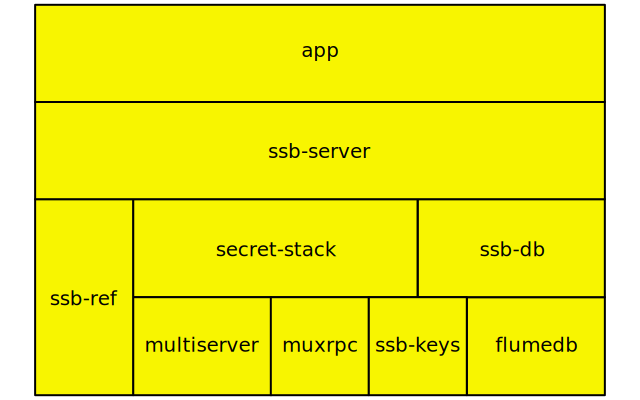
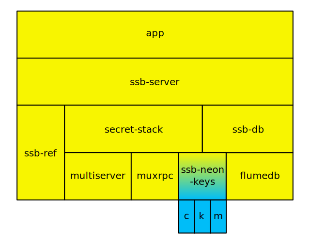
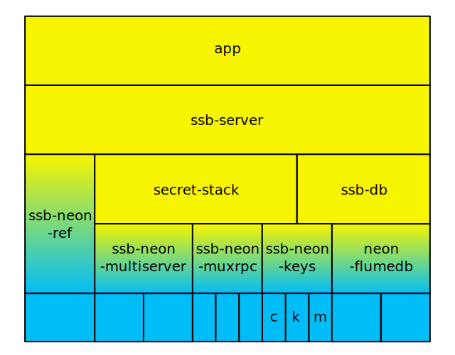
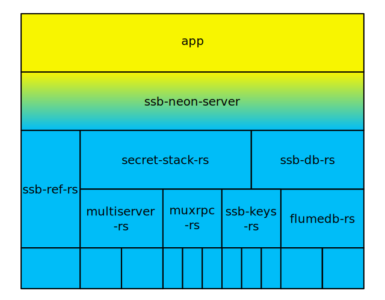
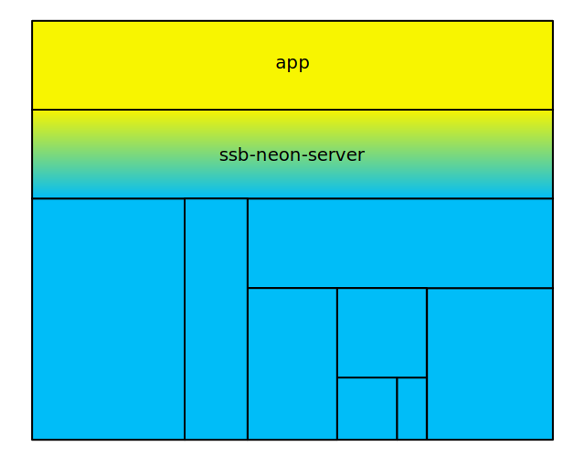

# The Plan

> Node for prototyping.
>
> Rust for production.

The goal with `ssb-rsjs` is to gradually convert the *canonical* implementation of SSB to Rust. Node.js served us well to quickly build SSB as a proof-of-concept, but as the ecosystem matures, we see the necessity for a reliable SSB implementation, either in performance, memory safety, error safety/clarity, or type safety. Rust is ideal for those properties.

While SSB can and should have alternative implementations in different languages/runtimes, we see ourselves still constantly dependent on the canonical implementation, which is Node.js. We are somewhat stuck with this implementation. **Instead of doing The Big Rewrite** (a lot of effort to guarantee compatibility) and advocating for app developers to migrate to the new implementation (a lot of effort), ssb-rsjs aims at **gradually migrating the canonical implementation** with a strict adherence to backwards compatibility.

We rely on [Neon](https://neon-bindings.com) or [Node-bindgen](https://github.com/infinyon/node-bindgen) or similar tools for the gradual migration. These tools allow you to write hybrid Node.js/Rust modules (in other words, "native Node modules implemented in Rust instead of C++"). This allows us not only to migrate to Rust, but also to keep using Node.js for prototyping new libraries and new approaches (JS is great for that), but for those SSB libraries that are now stable foundational modules, we should use Rust (Rust is great for that).

The plan for gradual migration is outlined below as multiple "horizons" (can be understood as milestones). In the diagrams below, yellow rectangles are modules implemented in JavaScript (Node.js), blue rectangles are Rust crates, and yellow-blue rectangles are hybrid JavaScript/Rust modules built with Neon or Node-bindgen or others. The diagrams are illustrative and abstract, specific details are not to be taken seriously or strictly.

## Horizon 0 (today)

> All modules are implemented in Node.js

This is the current state of the canonical SSB stack currently used in production in Patchwork, Patchbay, Manyverse, and Oasis. Some modules have native bindings to C, such as `ssb-keys` which depends on libsodium (implemented either in C, WASM, or JS).

## Horizon 1

> Most modules are implemented in Node.js, some are ssb-rsjs to bridge with pure Rust

(`c`, `k`, `m` under `ssb-keys-neon` stand for [`ssb-crypto`](https://github.com/sunrise-choir/ssb-crypto/), [`ssb-keyfile`](https://github.com/sunrise-choir/ssb-keyfile), and [`ssb-multiformats`](https://github.com/sunrise-choir/ssb-multiformats/tree/master/src), respectively)

We'll write RSJS modules that are functionally equivalent to their Node.js counterparts. `ssb-something-rsjs` should be 100% backwards compatible with `ssb-something`, with the same API, same expected behavior, passing the same test suite, and so forth.

These RSJS modules should be plug-and-play replacements to their Node.js counterparts, because we want to reduce migration efforts for app developers, which in turn means **reducing migration efforts for mid-level module developers**. The ideal amount of "effort" a mid-level module developer has to perform to use ssb-rsjs is one or two lines of code changed (such as a change in package.json).

We start from low-level modules (modules that don't depend on any others), such as `ssb-keys`, `ssb-ref`, `muxrpc`, `multiserver`, etc. Mid-level modules such as `secret-stack`, `ssb-db` are kept in Node.js.

Mid-level module developers need not adapt their codebase to the new stack. What's important is that **we get the new stack actually running in production**, to align incentives to maintain the new stack. This way we can connect low-level RSJS modules to mid-level Node.js modules, to app code, to app users. When users care about the app functioning correctly, they transitively care about the other levels in the stack including RSJS modules and Rust crates, which also means recurrently donated money will end up being used for maintaining the new stack. This is good!

A new stack can be as good as it gets, if it's not used in production, it becomes stale and needs to play catch-up with the old stack as the old one gets maintained, ending up stuck in a cycle where it's simultaneously high-quality yet useless. We need to create incentives for the new stack to be maintained, and create incentives for the old stack to become stale.

**The primary goal** of Horizon 1 is to allow some SSB Rust crates to be used in production for apps written in JS. Horizon 1 is not the optimal state, but it's necessary for us to reach Horizon 2. Horizon 1 might be non-ideal even for performance. Performance is not the goal of Horizon 1, gradual interoperable migration is.

## Horizon 2

> Most modules are ssb-rsjs bridging with pure Rust, some modules are still implemented in Node.js

As we get used to writing ssb-rsjs modules, gathering feedback and crash reports and platform support reports, we develop the habit of converting old stack modules to new stack modules.

All low-level modules in Horizon 2 are implemented in Rust, and mid-level Node.js modules from the old stack remain as a glue between everything. To facilitate interoperability, **RSJS modules and Rust modules should not aim to reorganize the internal structure of the stack**, they should mirror Horizon 0's structure, that is, traditional `muxrpc`, `multiserver`, `ssb-keys`, `flumedb` structure.

**The primary goal** of Horizon 2 is to guarantee that low-level modules run on all platforms and architectures needed for apps written in JS.

## Horizon 3

> All modules are Rust equivalents to Node.js modules, only one thin layer is ssb-rsjs to bridge with Node.js

The goal in Horizon 3 is to **convert mid-level modules from Node.js to Rust**. The only RSJS module in this horizon would be one thin layer that simply bridges between JavaScript and Rust. This is primarily useful for apps implemented in Electron or other JavaScript runtimes.

Horizon 3 should also enable apps implemented in other runtimes, for example Qt (desktop), Swift/ObjectiveC (iOS), Java/Kotlin (Android), Dart (Flutter), by using the Rust crates directly as native bindings, using no RSJS module in between.

For backwards compatibility and maintenance, the internal structure of Rust crates in the stack in Horizon 3 should mirror Horizon 0.

**The primary goal** of Horizon 3 is to allow apps implemented in runtimes other than JS to use the Rust stack. A secondary goal of Horizon 3 is to begin code-quality measures to standardize the maintenance of Rust crates, defining maintainer roles, responsibilities, and so forth.

## Horizon 4

> Freedom to reorganize Rust modules independently of how it looked like before with Node.js

When the stack has matured and is used by several apps in several runtimes (not just JS), we should have the freedom to reorganize Rust crates independently of the structure existing in Horizon 0.

In Horizon 4, we should devise a stable API for the top-most layer in the stack, capable of catering to several apps written in several runtimes. We should also consider at this point whether to have a plugin system (similar to `secret-stack`) and exactly how to design that.

**The primary goal** of Horizon 4 is performance, code quality, and cross-platform and cross-runtime compatibility. A secondary goal is to establish clearer maintenance rules, continuing the secondary goal from Horizon 3.

## Obstacles and imperfections

**Not supported on mobile** (an obstacle for Horizon 2). Although Rust is great for cross-compilation, currently Neon doesn't allow cross-compiling, so compilation is difficult for some platforms, especially iOS and Android. Eventually Neon aims at providing NAPI native modules, so that should make cross-platform support easier. Currently SSB RSJS works well on desktop, but we need it to work on mobile as well as on Raspberry Pis and such.

**Not supported in the browser** (an obstacle for Horizon 2). It's not clear, or it's not explicitly mentioned whether we can compile Neon/Node-bindgen modules to WebAssembly so to run in the browser. Neon would have to support compiling to WASM and making it seamless to use in the browser (in the long run, we would like to support [ssb-browser-core](https://github.com/arj03/ssb-browser-core/)).
